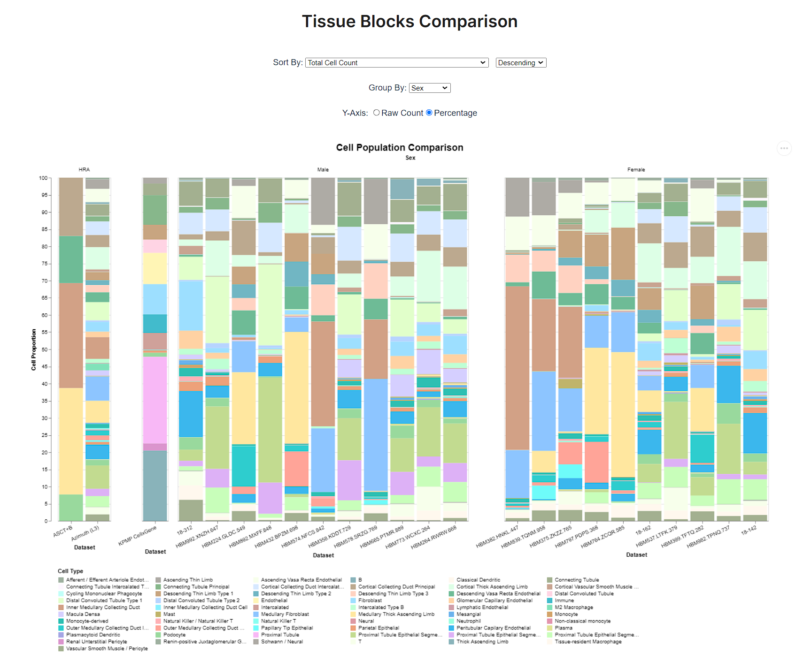

# Cell Type Distribution Graphs
 


Visualization tool for comparing cell type distributions in tissue blocks registered with HuBMAP and other public data portals. This project uses Angular 12 (generated with [Angular CLI](https://github.com/angular/angular-cli) version 12.2.12) and [Vega-Lite 4](https://vega.github.io/vega-lite/) for interactive visualizations.

## Description
<p align="center"></p>

Currently, cell type population can be visualized as counts or percentages in the form of bar graphs. Specific properties of the bar graph can be configured in [bargraph.visualization.ts](src/app/visualization/bargraph.visualization.ts), which follows the JSON schema for Vega-Lite Specification v4.

### Sorting
By default, the tissue blocks are sorted by total cell count in descending order. The unique cell types occurring across all datasets are considered automatically to provide a dropdown for sort, allowing sort by count or proportion of a specific cell type. In some cases, datasets have vertical tissue block positions available which allows sorting of the blocks by their Y-position (generally enabled for blocks registered on the [CCF-RUI](https://hubmapconsortium.github.io/ccf-ui/rui/)). Sorting can be updated within the transform property of the specification, which generates a computed property for ordering the datasets.

### Grouping
Grouping depends on the annotations available on the source dataset, such as sex, age group, ethnicity etc. Grouping makes use of the facet operator in Vega-Lite to show adjoining views for each group, as pictured above. Sorting also applies to each facet/group, considering the mean of the sorted property while ordering each facet.

### Legend
An existing color preset can be chosen to automatically populate the legend based on the unique cell types across all the datasets. The number of symbols per column can be configured among other `source`-specific options.

### Fixed Bars
Certain datasets can be excluded from sorting so that they appear at a fixed position in all views. Currently, fixed bars can only be positioned towards the left. The number of fixed bars can be configured in the `source` options. If the datasets need to be displayed in the same group, they must use the same value for the grouped attribute. Then the facet for that group always remains fixed to the left.

## Project Setup
### Compile with Hot Reload
```
ng serve
```
Development server will be hosted on http://localhost:4200/tissue-bar-graphs by default.
### Production Build
```
ng build
```
Build artifacts will be stored in the `dist/tissue-bar-graphs` directory.

### Building web component
```
npm run build:elements
```
Build artifacts for the web component will be stored in the `dist/hra-tissue-blocks` directory. This build uses Angular Elements with a custom Webpack build configuration.

### Web component options
The web component supports additional properties that can be passed to override the initial configuration for the bar graph.

<table>
<tr><th>Option</th><th>Description</th><th>Default Value</th></tr>
<tr><td><code>show-ui</code></td><td> Enables the configuration UI.</td><td><code>false</code></td></tr>
<tr><td><code>dataset-source</code></td><td>Datasheet source. Visit <a href="src/app/models/parameters.model.ts#L1">parameters.model.ts</a> for supported <code>Source</code> values.</td><td><code>bluelake_kidney</code></td></tr>
<tr><td><code>sort-by</code></td><td>Attribute/cell type on which datasets need to sorted. Depends on available cell types or sortable attributes for a collection.</td><td><code>Total Cell Count</code></td></tr>
<tr><td><code>group-by</code></td><td>Attribute/cell type on which facets will be displayed. Depends on groupable attributes for a collection.</td><td><code>None</code></td></tr>
<tr><td><code>y-axis-field</code></td><td>Field with quantitative data. Supported values are <code>count</code> and <code>percentage</code>.</td><td><code>count</code></td></tr>
<tr><td><code>order-type</code></td><td>Set ordering as <code>ascending</code> or <code>descending</code>.</td><td><code>descending</code></td></tr>
</table>

### Usage Example
```html
<!doctype html>
<html lang="en">
<head>
  <meta charset="utf-8">
  <title>HRA Tissue Blocks - Web Component Demo</title>
  <base href="/">
  <meta name="viewport" content="width=device-width, initial-scale=1">
  <script src="wc.js"></script>
</head>
<body>
  <hra-tissue-blocks y-axis-field="percentage" group-by="sex" order-type="ascending"></hra-tissue-blocks>
</body>
</html>
```

## Data Portal Links
Cellar (CODEX) - https://cellar.cmu.hubmapconsortium.org/app/cellar/

Cellxgene - https://cellxgene.cziscience.com/

GTEx - https://gtexportal.org/home/datasets/

Gut Cell Atlas - https://www.gutcellatlas.org/

HuBMAP - https://portal.hubmapconsortium.org/
